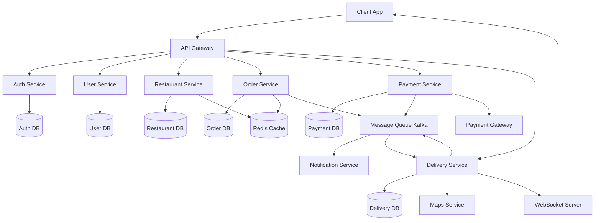

# Food Delivery System - High Level Design (HLD)

## 1. System Overview

A scalable distributed system that enables users to browse restaurants, place orders, make payments, and track deliveries in real-time.

The system follows a **microservices architecture** to ensure scalability, fault isolation, and independent deployment.

---

## 2. High-Level Architecture Diagram

---

## 3. Core Components

### 3.1 API Gateway

* Single entry point for all client requests
* Responsibilities:

  * Authentication validation (JWT)
  * Request routing
  * Rate limiting
  * Logging

---

### 3.2 Auth Service

* Handles:

  * User login/signup
  * Token generation (JWT)
* Ensures secure authentication

---

### 3.3 User Service

* Manages:

  * User profiles
  * Addresses
  * Preferences

---

### 3.4 Restaurant Service

* Handles:

  * Restaurant listings
  * Menu management
  * Search & filters
* Heavy read system → optimized using caching

---

### 3.5 Order Service (Core Service)

* Responsible for:

  * Creating orders
  * Managing order lifecycle
  * Maintaining order history
* Ensures:

  * Idempotency (no duplicate orders)
  * Strong consistency

---

### 3.6 Payment Service

* Handles:

  * Payment processing
  * Integration with payment gateways
  * Refunds
* Ensures:

  * Secure transactions
  * Failure handling

---

### 3.7 Delivery Service

* Responsible for:

  * Assigning delivery partners
  * Tracking delivery status
  * Managing delivery lifecycle

---

### 3.8 Message Queue (Kafka / RabbitMQ)

* Enables asynchronous communication
* Used for:

  * Order events
  * Notifications
  * Delivery assignment
* Prevents system blocking

---

### 3.9 Notification Service

* Sends:

  * Push notifications
  * SMS/email alerts
* Triggered via message queue

---

### 3.10 Cache (Redis)

* Used for:

  * Restaurant lists
  * Menus
  * Frequently accessed data
* Reduces database load

---

### 3.11 Databases

* Each service has its own database (**Database per Service pattern**)
* Types:

  * SQL (Orders, Payments)
  * NoSQL (Menus, logs)

---

## 4. Data Flow (Order Placement)

### Step-by-Step Flow

1. User places order via app
2. Request goes to API Gateway
3. Gateway authenticates user
4. Order Service creates order (status: CREATED)
5. Payment Service processes payment
6. On success:

   * Order status → CONFIRMED
   * Event sent to Message Queue
7. Delivery Service assigns partner
8. Notification Service sends updates
9. Real-time tracking begins via WebSocket

---

## 5. Key Design Decisions

### 5.1 Microservices Architecture

* Pros:

  * Independent scaling
  * Fault isolation
* Cons:

  * Increased complexity

---

### 5.2 Database per Service

* Avoids tight coupling
* Improves scalability

---

### 5.3 Asynchronous Communication

* Prevents blocking operations
* Improves performance

---

### 5.4 Caching Strategy

* Reduces latency
* Improves user experience

---

### 5.5 WebSockets for Real-Time Tracking

* Enables live delivery updates
* Low latency communication

---

## 6. Bottlenecks & Solutions

| Problem           | Solution            |
| ----------------- | ------------------- |
| High read traffic | Redis caching       |
| Order spikes      | Queue buffering     |
| Payment failures  | Retry + idempotency |
| Service failure   | Circuit breaker     |

---

## 7. Trade-Offs

* Strong consistency vs availability → prioritized for orders/payments
* Microservices vs monolith → chose scalability over simplicity
* SQL vs NoSQL → hybrid approach

---

## 8. Future Improvements

* AI-based recommendations
* Dynamic pricing
* Geo-sharding
* Advanced analytics

---
