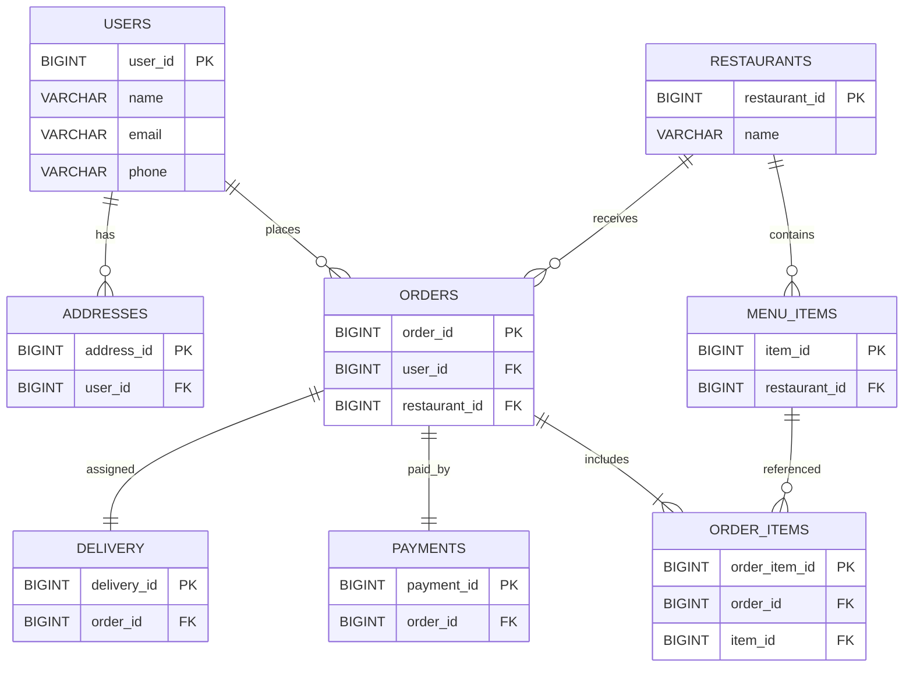

# Food Delivery System - Low Level Design

## 1. Database Design Overview

We use:

* Relational DB for transactions and consistency
* NoSQL for flexible menu storage

---

## 2. Relational Schema

### Users

```sql
CREATE TABLE users (
    user_id BIGSERIAL PRIMARY KEY,
    name VARCHAR(100) NOT NULL,
    email VARCHAR(150) UNIQUE NOT NULL,
    phone VARCHAR(15) UNIQUE NOT NULL,
    password_hash TEXT NOT NULL,
    created_at TIMESTAMP DEFAULT CURRENT_TIMESTAMP
);

CREATE INDEX idx_users_email ON users(email);
```

---

### Addresses

```sql
CREATE TABLE addresses (
    address_id BIGSERIAL PRIMARY KEY,
    user_id BIGINT REFERENCES users(user_id) ON DELETE CASCADE,
    address_line TEXT NOT NULL,
    city VARCHAR(50),
    pincode VARCHAR(10),
    latitude DECIMAL(9,6),
    longitude DECIMAL(9,6)
);

CREATE INDEX idx_addresses_user ON addresses(user_id);
```

---

### Restaurants

```sql
CREATE TABLE restaurants (
    restaurant_id BIGSERIAL PRIMARY KEY,
    name VARCHAR(150),
    location TEXT,
    rating DECIMAL(2,1),
    is_active BOOLEAN DEFAULT TRUE
);

CREATE INDEX idx_restaurants_rating ON restaurants(rating);
```

---

### Menu Items

```sql
CREATE TABLE menu_items (
    item_id BIGSERIAL PRIMARY KEY,
    restaurant_id BIGINT REFERENCES restaurants(restaurant_id) ON DELETE CASCADE,
    name VARCHAR(150),
    price DECIMAL(10,2),
    is_available BOOLEAN DEFAULT TRUE
);

CREATE INDEX idx_menu_restaurant ON menu_items(restaurant_id);
```

---

### Orders

```sql
CREATE TABLE orders (
    order_id BIGSERIAL PRIMARY KEY,
    user_id BIGINT REFERENCES users(user_id),
    restaurant_id BIGINT REFERENCES restaurants(restaurant_id),
    status VARCHAR(30) NOT NULL,
    total_price DECIMAL(10,2),
    created_at TIMESTAMP DEFAULT CURRENT_TIMESTAMP
);

CREATE INDEX idx_orders_user ON orders(user_id);
CREATE INDEX idx_orders_status ON orders(status);
```

---

### Order Items

```sql
CREATE TABLE order_items (
    order_item_id BIGSERIAL PRIMARY KEY,
    order_id BIGINT REFERENCES orders(order_id) ON DELETE CASCADE,
    item_id BIGINT REFERENCES menu_items(item_id),
    quantity INT NOT NULL,
    price DECIMAL(10,2) NOT NULL
);

CREATE INDEX idx_order_items_order ON order_items(order_id);
```

---

### Payments

```sql
CREATE TABLE payments (
    payment_id BIGSERIAL PRIMARY KEY,
    order_id BIGINT UNIQUE REFERENCES orders(order_id),
    status VARCHAR(20),
    amount DECIMAL(10,2),
    payment_method VARCHAR(50),
    created_at TIMESTAMP DEFAULT CURRENT_TIMESTAMP
);

CREATE INDEX idx_payments_status ON payments(status);
```

---

### Delivery

```sql
CREATE TABLE delivery (
    delivery_id BIGSERIAL PRIMARY KEY,
    order_id BIGINT UNIQUE REFERENCES orders(order_id),
    delivery_partner_id BIGINT,
    status VARCHAR(30),
    current_lat DECIMAL(9,6),
    current_lng DECIMAL(9,6)
);

CREATE INDEX idx_delivery_partner ON delivery(delivery_partner_id);
```

---

## 3. NoSQL Example

```json
{
  "restaurant_id": 101,
  "menu": [
    {
      "item_id": 1,
      "name": "Burger",
      "price": 120,
      "available": true
    }
  ]
}
```

---

## 4. Entity Relationship Diagram



---

## 5. Class Design

```java
class User {
    long userId;
    String name;
    String email;
}

class Order {
    long orderId;
    long userId;
    long restaurantId;
    List<OrderItem> items;
    double totalPrice;
    String status;
}

class OrderItem {
    long itemId;
    int quantity;
    double price;
}

class Restaurant {
    long restaurantId;
    String name;
}
```

---

## 6. Key Design Points

* Idempotent order creation using unique request identifiers
* Transactions ensure consistency for order and payment
* Indexing improves read performance
* Separate services own their data
* Strong consistency for orders and payments

---
